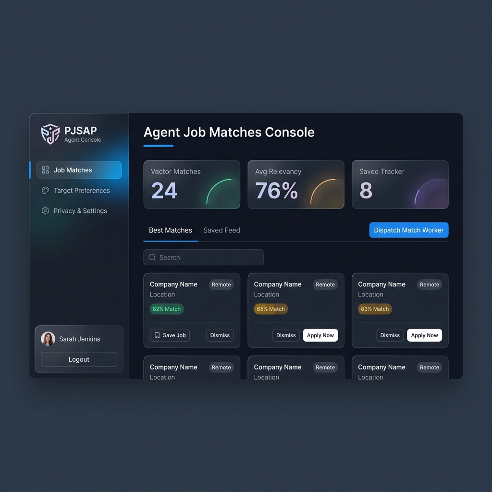
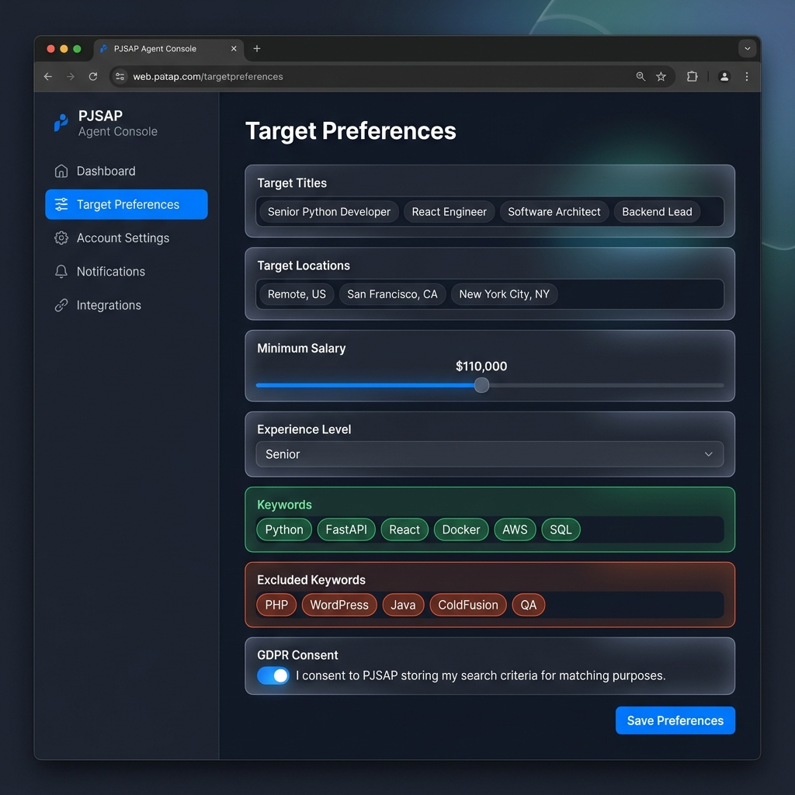
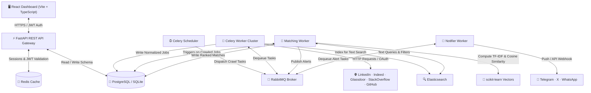

<p align="center">
  
</p>

<h1 align="center">🚀 PJSAP — Personalized Job Search Automation Platform</h1>

<p align="center">
  <em>An intelligent, privacy-first, containerized platform that crawls, aggregates, matches, and ranks job postings from multiple sources using real-time semantic vector scoring.</em>
</p>

<p align="center">
  
  
  
  
  
  
</p>

<p align="center">
  <a href="#-features">Features</a> •
  <a href="#-screenshots">Screenshots</a> •
  <a href="#-architecture">Architecture</a> •
  <a href="#-quick-start">Quick Start</a> •
  <a href="#-tech-stack">Tech Stack</a> •
  <a href="#-database-schema">Database</a> •
  <a href="#-testing--verification">Testing</a> •
  <a href="#-contributing">Contributing</a>
</p>

---

## ✨ What is PJSAP?

**PJSAP** isn't just another job board aggregator — it's an **AI-powered job hunting agent** that works *for* you. Configure your dream job criteria once, and PJSAP continuously crawls **5 major platforms** (LinkedIn, Indeed, Glassdoor, StackOverflow Jobs, GitHub Jobs), deduplicates listings, and ranks every result against your profile using **TF-IDF cosine similarity vectors**.

Think of it as having a personal recruiter that:
- 🔍 **Scans thousands of listings** across 5 platforms simultaneously
- 🧠 **Understands your preferences** — titles, skills, salary, locations, and dealbreakers
- 📊 **Ranks every job** with a transparency-first match score and detailed reasoning
- 🔒 **Respects your privacy** — full GDPR/CCPA compliance with data export and deletion
- 📱 **Notifies you instantly** via Telegram, X (Twitter), or WhatsApp when a perfect match drops

---

## 🖼️ Screenshots

<details>
<summary>🔐 <strong>Authentication Portal</strong> — Click to expand</summary>
<br/>
<p align="center">
  
</p>

> Glassmorphic login/register form with animated backgrounds, secure JWT authentication, and instant account creation.

</details>

<details open>
<summary>📊 <strong>Job Matches Dashboard</strong> — Click to expand</summary>
<br/>
<p align="center">
  
</p>

> Real-time dashboard with vector match metrics, search bar, segmented tabs (Best Matches / Saved Feed), one-click crawler dispatch, CSV export, and color-coded relevancy badges.

</details>

<details>
<summary>🎯 <strong>Target Preferences Engine</strong> — Click to expand</summary>
<br/>
<p align="center">
  
</p>

> Configure your ideal job profile: target titles, locations, salary floors, experience level, inclusion/exclusion keywords, and GDPR consent — all saved and used for semantic matching.

</details>

---

## 🏗️ Architecture

PJSAP operates as a **modular multi-service ecosystem** (via Docker Compose) or as a **lightweight standalone developer environment** (SQLite + sync execution).



---

## 🎯 Features

### 🔥 Core Capabilities

| Feature | Description |
|---------|-------------|
| **Multi-Platform Crawler** | Crawls LinkedIn, Indeed, Glassdoor, StackOverflow Jobs, and GitHub Jobs simultaneously |
| **Vector Matching Engine** | TF-IDF + Cosine Similarity scoring against user preference profiles using scikit-learn |
| **Real-time Dashboard** | Premium React 18 SPA with glassmorphism, Framer Motion animations, and live metric cards |
| **JWT Authentication** | Secure bcrypt-hashed passwords with HS256 JWT tokens (7-day expiry) |
| **AES-256 Encryption** | All sensitive credentials (social tokens, phone numbers) encrypted at-rest using Fernet |
| **GDPR/CCPA Compliance** | Full data portability (`/gdpr/export`) and right-to-be-forgotten (`/gdpr/delete`) |
| **CSV Job Tracker** | Export saved matches to spreadsheet for offline tracking and application management |
| **Social Notifications** | Automated alerts via Telegram, X (Twitter), and WhatsApp when high-match jobs are found |
| **Swagger API Docs** | Auto-generated interactive API documentation at `/docs` |

### 🛡️ Resilience Engineering

| Pattern | Implementation |
|---------|---------------|
| **Exponential Backoff + Jitter** | `initial_delay × (backoff_factor ^ attempt) + random_jitter` prevents network saturation |
| **Circuit Breaker** | 3 consecutive failures → 10-minute fast-fail cooldown per crawler source |
| **Graceful Degradation** | Elasticsearch down? Falls back to `ILIKE` SQL queries. RabbitMQ offline? Events logged to DB |

---

## 🛠️ Tech Stack

<table>
  <tr>
    <td align="center"><br/><b>FastAPI</b></td>
    <td align="center"><br/><b>React 18</b></td>
    <td align="center"><br/><b>TypeScript</b></td>
    <td align="center"><br/><b>PostgreSQL</b></td>
    <td align="center"><br/><b>Redis</b></td>
    <td align="center"><br/><b>Docker</b></td>
  </tr>
  <tr>
    <td align="center"><br/><b>Python 3.12</b></td>
    <td align="center"><br/><b>SQLAlchemy</b></td>
    <td align="center"><br/><b>Vite</b></td>
    <td align="center"><br/><b>Kubernetes</b></td>
    <td align="center"><br/><b>RabbitMQ</b></td>
    <td align="center"><br/><b>Elasticsearch</b></td>
  </tr>
</table>

| Layer | Technology | Purpose |
|-------|-----------|---------|
| **API Gateway** | FastAPI (async) | REST endpoints, JWT auth, DB connection pooling |
| **Frontend** | React 18 + TypeScript + Vite | Premium SPA with real-time updates and interactive profiling |
| **Styling** | Tailwind CSS 4 + Framer Motion | Glassmorphism design system with micro-animations |
| **Primary DB** | PostgreSQL 15 / SQLite | Stores users, profiles, jobs, matches, and audit trails |
| **Cache** | Redis 7 | Session caching, rate limiting, query buffering |
| **Search** | Elasticsearch 7.17 | High-speed fuzzy full-text job search and filtering |
| **Queue** | RabbitMQ 3 | Reliable concurrent task dispatching for workers |
| **Task Runner** | Celery 5.3 | Scheduled crawlers and decoupled matching pipelines |
| **ML Engine** | scikit-learn + NumPy | TF-IDF vectorization and cosine similarity computation |
| **Security** | cryptography (Fernet) | AES-256 at-rest encryption for sensitive credentials |
| **Orchestration** | Docker Compose / K8s | Multi-service deployment with health checks |
| **CI/CD** | GitHub Actions | Automated testing, linting, and Docker build validation |

---

## 🗄️ Database Schema

<details>
<summary>📋 Click to view the full ER diagram</summary>

```mermaid
erDiagram
    USERS {
        uuid id PK
        varchar email UK
        varchar hashed_password
        varchar full_name
        boolean is_active
        boolean is_superuser
        timestamp created_at
        timestamp updated_at
    }
    USER_PROFILES {
        uuid user_id PK_FK
        jsonb target_titles
        jsonb target_locations
        integer salary_min
        varchar experience_level
        jsonb job_types
        jsonb keywords
        jsonb excluded_keywords
        varchar resume_url
        boolean consent_given
        timestamp created_at
        timestamp updated_at
    }
    JOBS {
        uuid id PK
        varchar source
        varchar original_id
        varchar title
        varchar company
        varchar location
        boolean is_remote
        text description
        integer salary_min
        integer salary_max
        varchar salary_currency
        varchar url UK
        timestamp posted_at
        varchar hash_key UK
        timestamp created_at
    }
    JOB_MATCHES {
        uuid user_id PK_FK
        uuid job_id PK_FK
        double match_score
        jsonb matching_details
        varchar status
        timestamp created_at
        timestamp updated_at
    }
    SOCIAL_CREDENTIALS {
        uuid user_id PK_FK
        text twitter_token
        varchar telegram_chat_id
        varchar whatsapp_phone
        timestamp updated_at
    }
    AUDIT_LOGS {
        uuid id PK
        uuid user_id FK
        varchar action
        varchar ip_address
        varchar user_agent
        jsonb payload
        timestamp created_at
    }

    USERS ||--|| USER_PROFILES : "has"
    USERS ||--o{ JOB_MATCHES : "receives"
    JOBS ||--o{ JOB_MATCHES : "linked_to"
    USERS ||--|| SOCIAL_CREDENTIALS : "authenticates"
    USERS ||--o{ AUDIT_LOGS : "triggers"
```

</details>

---

## ⚡ Quick Start

### Option A: Standalone Developer Mode (No Docker Required)

The fastest way to get PJSAP running locally. Uses **SQLite** instead of PostgreSQL and runs crawlers synchronously.

#### 1. Clone the Repository

```bash
git clone https://github.com/nanda-81/JobSearchingAgent.git
cd JobSearchingAgent
```

#### 2. Backend Setup

```bash
cd backend
pip install -r requirements.txt
```

**Start the API server:**

<table>
<tr>
<td>

**Windows (PowerShell)**
```powershell
$env:DATABASE_URL="sqlite:///pjsap_dev.db"
uvicorn app.main:app --reload --port 8000
```

</td>
<td>

**Linux / macOS**
```bash
DATABASE_URL="sqlite:///pjsap_dev.db" \
uvicorn app.main:app --reload --port 8000
```

</td>
</tr>
</table>

> 📖 Interactive API docs available at **http://localhost:8000/docs**

#### 3. Frontend Setup

```bash
cd frontend
npm install
npm run dev
```

> 🎨 Dashboard available at **http://localhost:5173**

---

### Option B: Full Stack with Docker Compose

Spin up the complete production-grade ecosystem with a single command:

```bash
docker-compose up --build -d
```

This launches:
| Service | Port | Description |
|---------|------|-------------|
| **Frontend** | `3000` | Nginx-served React build |
| **Backend API** | `8000` | FastAPI gateway with Swagger docs |
| **PostgreSQL** | `5432` | Primary relational database |
| **Redis** | `6379` | Session & rate-limit cache |
| **Elasticsearch** | `9200` | Full-text search engine |
| **RabbitMQ** | `5672` / `15672` | Message queue + management UI |

---

## 🧪 Testing & Verification

### Automated Verification Script

Run the end-to-end verification engine that bootstraps a database, registers a user, configures preferences, executes all 5 crawlers, runs the matching engine, and validates GDPR compliance — all in **under 10 seconds**:

```bash
python verify_pjsap.py
```

**What it verifies:**
| Phase | Description |
|-------|-------------|
| Phase 1 | SQLite database bootstrap |
| Phase 2 | User registration & onboarding |
| Phase 3 | Preference optimization & targeting matrix |
| Phase 4 | Multi-platform crawler execution (5 sources) |
| Phase 5 | Vector matching engine with scored rankings |
| Phase 6 | GDPR/CCPA data export compliance |
| Phase 7 | Cleanup & teardown |

### CI/CD Pipeline

Every push triggers the GitHub Actions CI pipeline (`.github/workflows/ci.yml`):
- ✅ **Backend**: Pytest coverage suite (≥80% threshold)
- ✅ **Frontend**: TypeScript compilation + Vite production build
- ✅ **Docker**: Backend & Frontend image build validation

---

## 📁 Project Structure

```
JobSearchingAgent/
├── 📂 backend/
│   ├── 📂 app/
│   │   ├── 📂 api/v1/endpoints/    # REST route handlers (auth, profile, jobs, matches, gdpr, social)
│   │   ├── 📂 core/                # Config, security (JWT), AES-256 encryption
│   │   ├── 📂 db/                  # SQLAlchemy session & schema management
│   │   ├── 📂 models/              # ORM models (User, Profile, Job, Match, Audit)
│   │   ├── 📂 schemas/             # Pydantic request/response schemas
│   │   ├── 📂 services/
│   │   │   ├── 📂 crawler/         # LinkedIn, Indeed, Glassdoor, StackOverflow, GitHub crawlers
│   │   │   ├── 📂 matching/        # TF-IDF vector matching engine
│   │   │   ├── 📂 ml/              # scikit-learn pipeline utilities
│   │   │   ├── 📂 notification/    # Telegram, X, WhatsApp push services
│   │   │   └── 📂 social/          # Social credential management
│   │   ├── 📂 tasks/               # Celery task definitions & scheduler
│   │   └── main.py                 # FastAPI application entry point
│   ├── 📂 tests/                   # Pytest test suite
│   ├── Dockerfile
│   └── requirements.txt
├── 📂 frontend/
│   ├── 📂 src/
│   │   ├── 📂 components/          # Dashboard, ProfileForm, JobList, GDPRControls
│   │   ├── 📂 lib/                 # Utility functions
│   │   ├── App.tsx                 # Main application with auth + routing
│   │   ├── index.css               # Tailwind + custom design system
│   │   └── main.tsx                # Vite entry point
│   ├── Dockerfile
│   ├── nginx.conf
│   └── package.json
├── 📂 kubernetes/
│   └── pjsap-deploy.yaml           # K8s deployment manifest
├── 📂 .github/workflows/
│   └── ci.yml                       # GitHub Actions CI pipeline
├── docker-compose.yml               # Full-stack orchestration
├── verify_pjsap.py                  # End-to-end verification script
└── README.md
```

---

## 🔒 Security & Privacy

PJSAP is built with privacy as a **first-class architectural concern**, not an afterthought:

| Principle | Implementation |
|-----------|---------------|
| **Encryption at Rest** | AES-256 (Fernet) for all social API tokens, Telegram IDs, and phone numbers |
| **Password Security** | bcrypt hashing with automatic salt generation |
| **JWT Authentication** | HS256-signed tokens with configurable expiry |
| **GDPR Data Portability** | `GET /api/v1/gdpr/export` — instant JSON download of all user data |
| **Right to Deletion** | `DELETE /api/v1/gdpr/delete` — recursive cascade wipe of all user data |
| **Audit Trail** | Every security-sensitive action logged with IP, user agent, and timestamp |
| **CORS Protection** | Strict origin allowlisting for cross-origin requests |

---

## 🤝 Contributing

Contributions are welcome! Here's how to get started:

1. **Fork** the repository
2. **Create** a feature branch (`git checkout -b feature/amazing-feature`)
3. **Commit** your changes (`git commit -m 'feat: add amazing feature'`)
4. **Push** to the branch (`git push origin feature/amazing-feature`)
5. **Open** a Pull Request

---

## 📄 License

This project is licensed under the **MIT License** — see the [LICENSE](LICENSE) file for details.

---

## 💬 Support

If you found this project helpful, please consider giving it a ⭐ on GitHub!

<p align="center">
  <sub>Built with 💙 using FastAPI, React, and a lot of ☕</sub>
</p>
