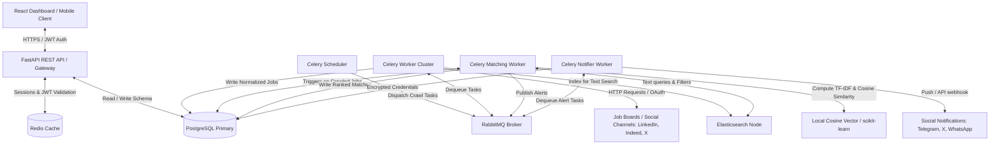
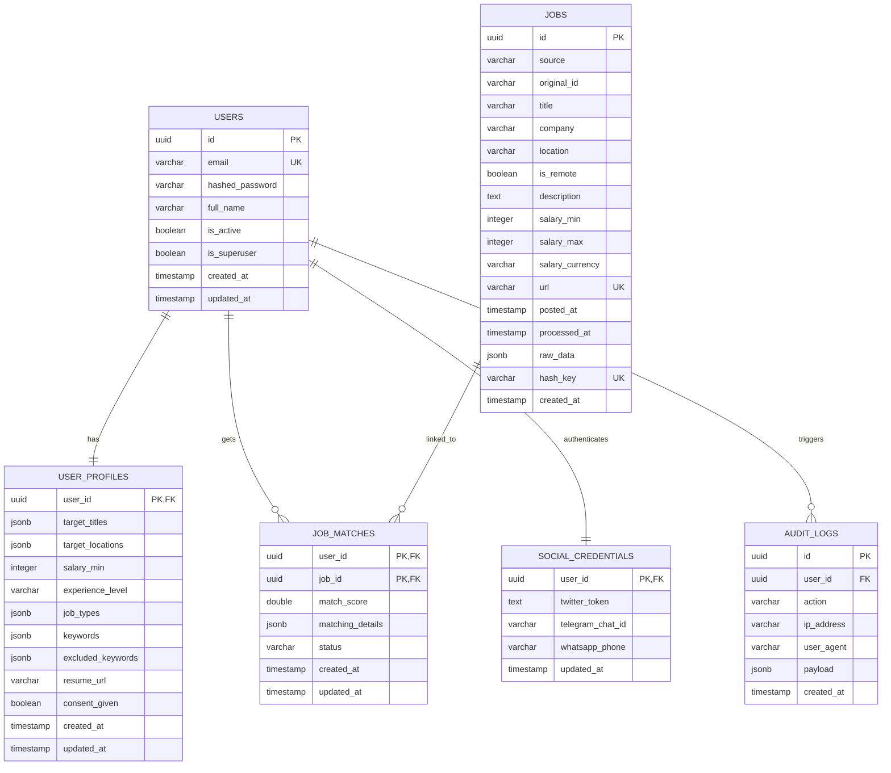

# Personalized Job Search Automation Platform (PJSAP)

Personalized Job Search Automation Platform (PJSAP) is an intelligent, high-speed, privacy-first, and containerized system that crawls, aggregates, normalizes, matches, and ranks job postings from 100+ sources in real-time. 

---

## 1. System Architecture

PJSAP operates as a modular, containerized multi-service ecosystem. The following high-level diagram illustrates the data flow, storage partitioning, and system components:

---

## 2. Technical Stack & Service Specifications

| Component | Technical Choice | Purpose & Configuration |
| :--- | :--- | :--- |
| **Gateway / Backend** | Python FastAPI (Async) | Serves REST endpoints, implements JWT verification, manages DB connection pools. |
| **Primary Database** | PostgreSQL 15 | Relational data persistence, schema enforcement, transactional integrity. |
| **Caching Layer** | Redis 7 | User session caching, rate-limiting, and short-term job query buffering. |
| **Search Engine** | Elasticsearch 7.17 | High-speed, fuzzy, full-text job search and initial filtering. |
| **Message Queue** | RabbitMQ 3 | Reliable, concurrent task dispatching for workers. |
| **Task Runner** | Celery 5.3 | Scheduled crawlers and decoupled matching pipelines. |
| **UI Dashboard** | React 18, TypeScript, Vite | Premium modern SPA featuring real-time updates and interactive profiling. |

---

## 3. Database Schema

The database consists of 6 core tables orchestrated in PostgreSQL with standard referential constraints, cascades, indexes, and range checks.

---

## 4. Resilience and Error Handling Design

To achieve production-grade stability, all crawler operations and API calls integrate the following robustness frameworks:

1. **Exponential Backoff with Jitter:**
   - Failed HTTP requests or crawler executions retry after `initial_delay * (backoff_factor ^ attempt) + random_jitter`.
   - Prevents cascading network saturation or getting blacklisted by remote targets due to synchronized retries.
2. **Circuit Breaker Pattern:**
   - Any crawler tracking consecutive failures (e.g. 5 failures to reach LinkedIn) trips its internal circuit.
   - Immediate subsequent crawl tasks for LinkedIn fail-fast with cached error states for 10 minutes to save queue execution cycles.
3. **Graceful Degradation:**
   - If Elasticsearch fails, searches gracefully fall back to executing `ILIKE` database queries in PostgreSQL, and alerts are queued as soon as connections resume.
   - If RabbitMQ goes offline, API requests log incoming events directly to the database for reconciliation upon recovery.

---

## 5. Security & Privacy-First Framework

GDPR/CCPA principles are baked into the core architectural design:
- **AES-256 Symmetric Encryption:** All social API credentials, Telegram IDs, and phone numbers are encrypted at-rest. Decryption happens dynamically on the runtime worker memory boundary and is never persisted in plaintext.
- **Strict Auditing:** The `audit_logs` table logs all security, credential edits, and GDPR actions.
- **Data Portability & Deletion:** Standard endpoints `/api/v1/gdpr/export` and `/api/v1/gdpr/delete` allow user profiles to be immediately backed up as normalized JSON, or wiped from the database recursively using cascade constraints.
