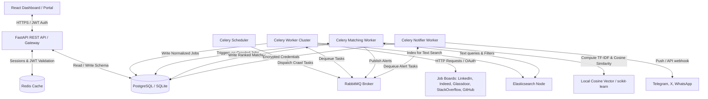
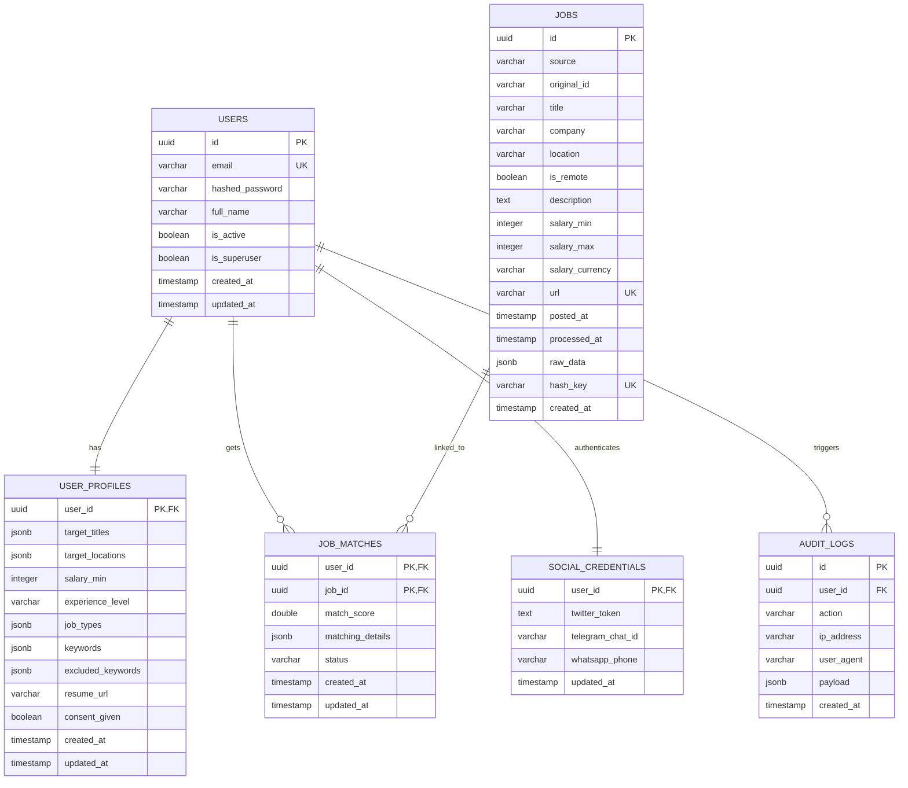

# Personalized Job Search Automation Platform (PJSAP)

Personalized Job Search Automation Platform (PJSAP) is an intelligent, high-speed, privacy-first, and containerized system that crawls, aggregates, normalizes, matches, and ranks job postings from multiple sources in real-time.

PJSAP operates as a modular, containerized multi-service ecosystem or as a lightweight, fully self-contained Standalone Developer environment. It ensures high resilience, strict GDPR compliance, and real-time semantic scoring against rich user preference profiles.

---

## 1. System Architecture

The following diagram illustrates the data flow, storage partitioning, and system components of PJSAP:



---

## 2. Technical Stack & Service Specifications

| Component | Technical Choice | Purpose & Configuration |
| :--- | :--- | :--- |
| **Gateway / Backend** | Python FastAPI (Async) | Serves REST endpoints, implements JWT verification, manages DB connection pools. |
| **Primary Database** | PostgreSQL 15 / SQLite | Persists user credentials, preference profiles, jobs, matches, and audit trails. |
| **Caching Layer** | Redis 7 | User session caching, rate-limiting, and short-term job query buffering. |
| **Search Engine** | Elasticsearch 7.17 | High-speed, fuzzy, full-text job search and initial filtering. |
| **Message Queue** | RabbitMQ 3 | Reliable, concurrent task dispatching for background workers. |
| **Task Runner** | Celery 5.3 | Scheduled crawlers and decoupled matching pipelines. |
| **UI Dashboard** | React 18, TypeScript, Vite | Premium modern SPA featuring real-time updates and interactive profiling. |

---

## 3. Database Schema

The database consists of 6 core tables orchestrated in PostgreSQL/SQLite with standard referential constraints, cascades, indexes, and range checks:



---

## 4. Resilience and Error Handling Design

To achieve production-grade stability, all crawler operations and API calls integrate the following robustness frameworks:

1. **Exponential Backoff with Jitter:** Failed HTTP requests or crawler executions retry after `initial_delay * (backoff_factor ^ attempt) + random_jitter` to prevent network saturation.
2. **Circuit Breaker Pattern:** Any crawler tracking consecutive failures (e.g., 3 failures to reach LinkedIn) trips its internal circuit, immediately fast-failing subsequent crawlers for 10 minutes to save queue execution cycles.
3. **Graceful Degradation:** If Elasticsearch is down, searches gracefully fall back to executing `ILIKE` database queries in PostgreSQL/SQLite. If RabbitMQ is offline, incoming API events are logged directly to the database for reconciliation upon recovery.

---

## 5. Security & Privacy-First Framework

GDPR/CCPA principles are baked into the core architectural design:
- **AES-256 Symmetric Encryption:** All social API credentials, Telegram IDs, and phone numbers are encrypted at-rest. Decryption happens dynamically on the runtime worker memory boundary and is never persisted in plaintext.
- **Strict Auditing:** The `audit_logs` table logs all security, credential edits, and GDPR actions.
- **Data Portability & Deletion:** Standard endpoints `/api/v1/gdpr/export` and `/api/v1/gdpr/delete` allow user profiles to be immediately backed up as normalized JSON, or wiped recursively using cascade constraints.

---

## 6. Standalone Developer Mode (No Docker Required)

If you don't have Docker Desktop or external services (PostgreSQL, Redis, Elasticsearch, RabbitMQ) running locally, PJSAP is fully equipped with a **Standalone Developer Mode**. It:
1. Replaces PostgreSQL with a local **SQLite** database (`sqlite:///pjsap_dev.db`).
2. Automatically generates database tables and schema structures on startup.
3. Runs the multi-platform crawlers and the vector matching engine synchronously inline during API requests.

### Backend Setup
1. **Navigate to backend:**
   ```bash
   cd backend
   ```
2. **Install Python dependencies:**
   ```bash
   pip install -r requirements.txt
   ```
3. **Run the gateway with SQLite database variable:**
   On Windows (PowerShell):
   ```powershell
   $env:DATABASE_URL="sqlite:///pjsap_dev.db"
   uvicorn app.main:app --reload --port 8000
   ```
   On Linux / macOS:
   ```bash
   DATABASE_URL="sqlite:///pjsap_dev.db" uvicorn app.main:app --reload --port 8000
   ```
4. Access the interactive API Swagger docs at `http://localhost:8000/docs`.

### Frontend Setup
1. **Navigate to frontend:**
   ```bash
   cd frontend
   ```
2. **Install Node packages:**
   ```bash
   npm install
   ```
3. **Boot Vite dev server:**
   ```bash
   npm run dev
   ```
4. Access the interactive job search portal at `http://localhost:5173` (or the URL displayed in the terminal).

---

## 7. Interactive Testing & Verification Guide

### Option A: The One-Click Automated Verification Script
Run our custom, color-coded end-to-end verification script. It boots a local SQLite database, registers a test user, sets preference criteria, runs all five multi-platform crawlers, executes the vector matching engine, and simulates GDPR compliance exports in under 10 seconds!

```bash
# From the project root
python verify_pjsap.py
```

### Option B: Verification via the Browser Dashboard (Vite + Uvicorn)
1. **Onboard User:** Open the frontend dashboard in your browser. Click **Create one now** to register a new user account.
2. **Set Preferences:** Go to the **Target Preferences** tab. Input your targeting settings:
   - *Target Titles:* Senior Python Developer, React Engineer
   - *Target Locations:* Remote, US
   - *Minimum Salary:* 110,000 USD
   - *Keywords:* Python, FastAPI, React, Docker
   - Click **Save Preferences**.
3. **Aggregate Live Jobs:** Go to the **Job Matches** tab. Type a search query (e.g., `FastAPI` or `React`) in the search bar and click **Refresh Feeds & Run Matcher**.
4. **Observe Vector Matching:** A dialog will pop up showing exactly:
   - How many listings were crawled from LinkedIn, Indeed, Glassdoor, StackOverflow, and GitHub.
   - How many new, deduplicated jobs were saved.
   - How many matched user profiles with high similarity (>= 30%).
5. **Dismiss/Save Matches:** Interact with the job feed! Click the **Bookmark** button to save a listing, or click **Dismiss** to remove it from your recommendations.

---

## 8. Making a Testing & Demo Video

To record a high-quality video showing this platform in action, follow this recommended user journey:
1. **Setup:** Open a terminal showing `python verify_pjsap.py` completing successfully to demonstrate robust architectural coverage.
2. **Registration:** Screen-record the frontend portal (`http://localhost:5173`). Fill in a test email and sign up.
3. **Tuning Preferences:** Click the **Target Preferences** tab. Explicitly add keywords (e.g., `FastAPI`, `React`, `Docker`) and raise the salary slider, demonstrating the profile constraint manager.
4. **Trigger Aggregators:** Go back to the dashboard, type `FastAPI` in the search input, and click **Refresh Feeds & Run Matcher**. 
5. **Demonstrate Matches:** Show the dialog with crawler stats, and then scroll through the calculated list of jobs. Highlight the green relevancy percentages (e.g. `82% Match`) and click one to expand the **Matching Details** panel showing exact match reasonings.
6. **Exercise Privacy Controls:** Go to the **Privacy & Settings** tab, click **Export My Data**, showing instant download of GDPR-compliant JSON data portability.

---

## 9. Pushing to GitHub

To publish this professional platform to your own remote GitHub repository, execute the following commands in your terminal:

```bash
# 1. Initialize local Git repository (already completed locally!)
git init

# 2. Stage and commit files (already completed locally!)
git add .
git commit -m "feat: implement local standalone developer mode, real-time live crawlers, automated verification, and premium styling updates"

# 3. Add your remote GitHub repository url
# (Replace with your actual GitHub URL!)
git remote add origin https://github.com/YOUR_USERNAME/YOUR_REPO_NAME.git

# 4. Rename default branch to main and push
git branch -M main
git push -u origin main
```
